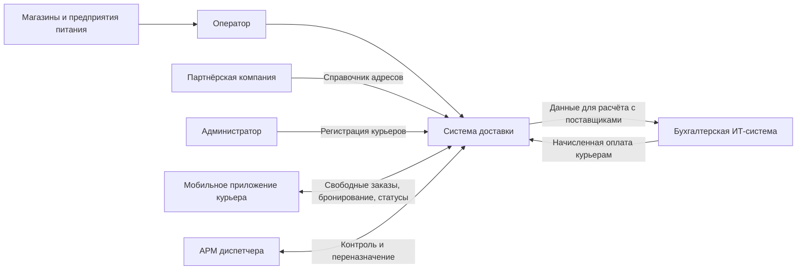

# Integration of IT Systems

Предпроектный анализ информационных потоков, мастер-систем и требований к интеграции для онлайн-платформы доставки.

## О проекте

Выполнен интеграционный анализ сервиса, который собирает заказы от магазинов и предприятий питания, распределяет их между курьерами, контролирует выполнение доставки, взаимодействует с бухгалтерской системой и административным контуром.

Цель работы — подготовить основу для проектирования интеграций: определить данные, источники и получателей, описать форматы и сценарии обмена, оценить объёмы, частоту и сроки передачи данных.

## Бизнес-контекст

Сервис доставки работает с несколькими типами участников:

- магазины и предприятия питания передают информацию о заказах;
- оператор приводит заказы из разных источников к единому формату и вводит их в систему;
- курьер через мобильное приложение просматривает доступные заказы, бронирует их и обновляет статусы;
- диспетчер контролирует курьеров и при необходимости переназначает заказы;
- бухгалтерская система рассчитывает оплату поставщикам и курьерам;
- администратор регистрирует курьеров и управляет правами доступа;
- партнёрская компания предоставляет первичный справочник адресов комплектации.

## Цели работы

- Выявить входящие и исходящие потоки данных.
- Определить мастер-системы для входящих данных.
- Определить системы-получатели для исходящих данных.
- Разработать словари данных по каждому потоку.
- Описать сценарии интеграции.
- Оценить объёмы, пиковые нагрузки, частоту и сроки передачи.
- Сформировать требования к интеграционным решениям.

## Ландшафт интеграции

## Ключевые потоки данных

| № | Поток данных | Назначение | Направление | Мастер-система / получатель |
|---|---|---|---|---|
| 1 | Регистрация заказа | Получение информации о новом заказе для ввода оператором | В систему | Оператор |
| 2 | Информация о свободных заказах | Предоставление курьерам и диспетчеру доступных заказов | Из системы | Мобильное приложение курьера, АРМ диспетчера |
| 3 | Бронирование заказа | Фиксация выбора заказа курьером | В систему | Курьер |
| 4 | Статус выполнения заказа | Обновление хода доставки | В систему | Курьер |
| 5 | Данные для расчёта с поставщиками | Передача доставленных заказов в бухгалтерию | Из системы | Бухгалтерская ИТ-система |
| 6 | Данные о начисленной оплате курьерам | Получение суммы оплаты за выполненные доставки | В систему | Бухгалтерская ИТ-система |
| 7 | Данные о регистрации курьера | Ввод информации о новом курьере | В систему | Администратор |
| 8 | Первичная загрузка адресов комплектации | Загрузка справочника адресов от партнёра | В систему | Партнёрская компания |

## Мастер-системы и системы-получатели

Для каждого входящего потока определена мастер-система — источник эталонных данных:

- заказы — оператор, так как он унифицирует данные из разных магазинов;
- бронирование и статусы — курьер через мобильное приложение;
- начисленная оплата — бухгалтерская система;
- регистрация курьеров — администратор;
- справочник адресов — партнёрская компания.

Для исходящих потоков определены получатели:

- свободные заказы — мобильное приложение курьера и АРМ диспетчера;
- данные для расчёта с поставщиками — бухгалтерская ИТ-система.

Проверено соответствие мастер-систем и получателей для связанных данных: заказ, бронирование, статус доставки и финансовые расчёты образуют согласованную цепочку.

## Словарь данных

Для каждого потока разработан словарь данных. В нём описаны:

- название потока, назначение и направление;
- блоки и вложенность;
- обязательность блоков;
- атрибуты: название, тип данных, длина, обязательность, ограничения и условия.

Примеры сущностей:

- `Заказ`: идентификатор, дата создания, клиент, телефон, адрес комплектации, адрес доставки, желаемые сроки, сумма, комментарий, состав заказа.
- `Бронирование`: идентификатор заказа, идентификатор курьера, время бронирования.
- `Статус заказа`: идентификатор заказа, идентификатор курьера, статус, временная метка, координаты, причина проблемы, фото подтверждения.
- `Отчёт по доставкам`: номер отчёта, период, дата формирования, заказ, магазин, дата доставки, стоимость.
- `Расчёт оплаты`: идентификатор курьера, период, количество доставок, сумма к выплате, дата выплаты.
- `Курьер`: идентификатор, ФИО, телефон, логин, пароль, роль, статус, дата регистрации.
- `Справочник адресов`: идентификатор точки, адрес, контактное лицо, телефон, часы работы.

## Сценарии интеграции

Для каждого потока описан сценарий интеграции в формате use case:

- **Регистрация заказа** — оператор получает заказ, заполняет форму, система валидирует данные и присваивает идентификатор.
- **Свободные заказы** — мобильное приложение курьера запрашивает список доступных заказов, система возвращает актуальные данные.
- **Бронирование** — курьер выбирает заказ, система проверяет отсутствие брони и закрепляет заказ за курьером.
- **Статус выполнения** — курьер обновляет статус, при необходимости передаёт координаты, фото или причину проблемы.
- **Расчёт с поставщиками** — система формирует отчёт по доставленным заказам и передаёт его в бухгалтерию.
- **Начисленная оплата** — бухгалтерская система передаёт суммы выплат, система обновляет личный кабинет курьера.
- **Регистрация курьера** — администратор создаёт учётную запись и назначает права доступа.
- **Загрузка адресов** — администратор загружает файл от партнёра, система проверяет формат и заполняет справочник.

## Объёмы и нагрузка

| № | Поток данных | Среднее количество | Средний размер | Пиковые периоды | Пиковое количество |
|---|---|---|---|---|---|
| 1 | Регистрация заказа | 50/час | 1–2 КБ | Обед, вечер | 150/час |
| 2 | Информация о свободных заказах | 300/час | 500 Б – 10 КБ | Утро, вечер | 600/час |
| 3 | Бронирование заказа | 50/час | 200 Б | Обед, вечер | 150/час |
| 4 | Статус выполнения заказа | 100/час | 300 Б – 1 МБ | Вечер | 300/час |
| 5 | Данные для расчёта с поставщиками | 1/день | 50–500 КБ | Понедельник, конец месяца | 1/день + повторы |
| 6 | Начисленная оплата курьерам | 1/сутки | 50–200 КБ | Пятница | 2/сутки |
| 7 | Регистрация курьера | 2–3/день | 500 Б | Начало месяца | 10/день |
| 8 | Первичная загрузка адресов | 1 раз | 1–10 МБ | — | 1 раз |

## Частота и сроки доставки

| № | Поток данных | Желаемая частота | Желаемый срок | Макс. частота | Мин. частота | Макс. срок | Мин. срок |
|---|---|---|---|---|---|---|---|
| 1 | Регистрация заказа | Real-time | < 1 мин | 300/час | 0 | 5 мин | < 10 сек |
| 2 | Свободные заказы | Pull каждые 30 сек | < 30 сек | каждые 10 сек | каждые 5 мин | 1 мин | 5 сек |
| 3 | Бронирование | Real-time | < 5 сек | 300/час | 0 | 10 сек | 1 сек |
| 4 | Статус выполнения | По факту изменения | < 10 сек | 600/час | 10/час | 30 сек | 2 сек |
| 5 | Расчёт с поставщиками | 1 раз в сутки, 02:00 | до 04:00 | 4/сутки | 1/нед | 24 часа | 1 час |
| 6 | Начисленная оплата | 1 раз в сутки | до 08:00 | 2/сутки | 1/нед | 48 часов | 1 час |
| 7 | Регистрация курьера | По факту приёма | < 15 мин | 20/день | 0 | 1 час | 1 мин |
| 8 | Загрузка адресов | Единоразово | При загрузке | — | — | — | — |

## Принятые решения

- Оператор выбран единой точкой нормализации заказов из разнородных источников.
- Курьерское мобильное приложение является мастер-системой для бронирования и статусов доставки.
- Бухгалтерская система — мастер для начислений оплаты курьерам.
- Для оперативных потоков подходят REST/сообщения и асинхронная доставка событий.
- Для отчётности и финансовых расчётов допустим файловый обмен или API по расписанию.
- Для справочника адресов достаточно одноразовой загрузки файла.
- Для критичных потоков необходимо предусмотреть повторные отправки, логирование и обработку ошибок.

## Результаты

- Выявлено 8 потоков данных: 6 входящих и 2 исходящих.
- Определены мастер-системы и системы-получатели.
- Разработаны словари данных по каждому потоку.
- Описаны сценарии интеграции в формате use case.
- Оценены средние и пиковые нагрузки.
- Заданы требования по частоте, срокам и допустимым задержкам.
- Сформирована основа для выбора стилей интеграции и проектирования обменных форматов.
